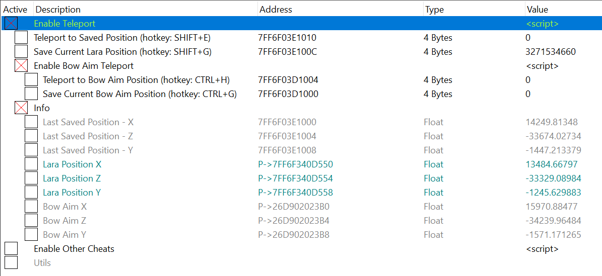

# Cheat Tables
Cheat Tables for Cheat Engine

## Shadow of the Tomb Raider
Download here: [SOTTR.ct](https://raw.githubusercontent.com/Neurone/cheat-tables/main/sottr/SOTTR.ct). The table works with the latest `SOTTR.exe v1.0 build 489.0_64`, Steam version.

I added the teleport to this super cool cheat table created by [Cielos](https://fearlessrevolution.com/memberlist.php?mode=viewprofile&u=177), posted on [fearlessrevolution.com](https://fearlessrevolution.com/viewtopic.php?p=281836#p281836). 

### Teleport feature
You can teleport everywhere inside the same area. The same area means every place you can go without explicit loading, i.e., via a campfire, or hidden loading, i.e., entering a cave. You can change the assigned hotkeys inside Cheat Engine.

Load the game, activate **Enable Teleport**, and now you can:
  - Save your current position `SHIFT+G`
  - Teleport to a previously saved position `SHIFT+E`
  - If you activate **Enable Bow Aim Teleport**, you can:
    - Aim with the bow and save the aimed position `CTRL+G`. You can teleport to the saved position with `SHIFT+E`
    - Aim with the bow and teleport `CTRL+H`. This option teleports you directly to the aimed location
  - If you are curious about the position details, enable the **Info** section

### Other features

**undead**
- health still drops when damaged, but you won't be killed.

**inf focus duration**
- focus mode last until you visit camp or scene-change once activated.
- press Shift + ` to force de-activate focus mode.

**inf focus time**
- when focus mode is activated, a slow-down time for aiming would last 24 hours.
- there is still about half a second "cooldown" in-between aiming. Reloading a gun shouldn't be a problem, but you may need to re-aim if you change your weapon during aiming to re-enter the slow-down state.
- You must first learn the skill "Scales of Serpent III" (Focus Time upgrade) for this script to work correctly.

**no reload**
- ammo clip still drops when firing the weapon, but it won't reach zero.

**inf ammo pouch/arrow**
- ammo pouch/arrow still drops when firing the weapon, but it won't drop below 1.
- you can reload to full clip even if you have only one ammo pouch left.

**custom max stack size**
- by script default, it raises the max arrows (all four types of arrows) your quiver can hold, the max normal/alt ammo of the guns you have, and the resources you can hold.

**access locked/newgame+ skills**
- allows you to learn the newgame+ skills in a non-newgame+ game.
- all skills' requirements are ignored. i.e., you can learn a skill without learning the adjacent skills. First, you can learn the newgame+ skills before learning all the skills in the same category.
- note that with this script alone, you still need to have the required skill points to learn a skill.
- newgame+ skills in a non-newgame+ game would appear locked, but you can still learn them.
- the skills that are unlocked from tombs are not tested.

**ignore resources**
- you don't need any resources to craft.
- resources still decrease until they reach zero when you craft.

**ignore skill points**
- you don't need any skill points to learn new skills.
- skill points still decrease until it reaches zero when you learn skills.
- skill points pointer can be found after you activate the script, in case you want to reset it to zero. It's not advised to freeze this value, though. Visit the camp after the script is activated to populate the pointer.

**ignore gold pieces**
- you don't need gold pieces to trade with merchants.
- the number of gold pieces decreases until it reaches zero after purchase.

**blinded enemies**
- enemies won't spot you even if you're in their line of sight when you're in stealth mode.
- enemies can still hear noise and would go to investigate the source of noise, which means you can still distract them with a bottle/arrow if you want to.
- enemies can still enter battle if you open fire with loud weapons, touch them physically, and/or witness you killing one of them.
- enemies will have "normal eyesight" in battle.

**stupid enemies**
- when you're in stealth mode, enemies can still spot you in their line of sight, but they won't start attacking you until they witness you kill one of them, touch one of them physically, and/or you open fire with loud weapons.

**ignore weapon appearance change**
- allows you to hide the weapons' upgrade/part appearance individually while the upgrades' benefits are still applied.
- choose "**ignored**" to hide the upgrade/part appearance; "**as is**" to show the upgrade/part appearance (if you've crafted the upgrade).
- by script default, all covered weapons' appearance changes will be "**ignored**".
- covering only some weapon upgrades/parts yet; they will be updated.

**some flags fetch**
- allows you to toggle the "obtained" flag of some of the weapon's upgrades and parts.
- only a few flags are present for now.
- some flags, e.g., silencer, require you to re-visit a camp after you flip it to "obtained" for it to be applied to the weapon properly.
- you can flip the knives to "obtained" and change the knife in the camp. The newgame+ knife is included. Sadly you can't choose the "tutorial knife" with this method.
- not all flags are thoroughly tested.

**rifles suppressor key**
- you have to obtain a suppressor for rifles first.
- for the best result, you should use **ignore weapon appearance change** to hide the suppressor for rifles.
- won't work on rifles that can't equip the suppressor; if in doubt, you can check it in the camp menu.
- when activated, firing a rifle with a suppressor (e.g., WASP 11) would fire loud ammo as usual. **Press and hold the spacebar** would fire silence ammo.
- yet to test the silence ammo in stealth missions, though.

**walk key**
- the awkward transition from idle pose to walk is still present in this installment (you start with the ready-to-run animation and suddenly switch back to walk animation), and it turns out the whole module is the same, so here it is.
- when activated, hold the mod key to walk.
- you can choose from SHIFT, CTRL, ALT (default), or CAPS LOCK as the walk mod key provided in the dropdown list.
- note that it's NOT done by modifying the walk behavior of the game's default walk key but by manipulating the moving speed directly instead. You should have a separate key for this script's walk key that differs from the game's. e.g., if you want to use ALT as this script walk key, make sure you've changed the game's walk key to a different key.
- if you don't like the preset walk speed, change it via the "Speed" entry. By script default, it's slightly faster than the game's walk key speed, as it's too slow for me.

**unlock all outfits**
- all outfits (sets, torso, and legs) would be unlocked, including the newgame+ outfits and some unused outfits.
- some unused outfits without texture will also have no shadows on the ground.
- **instruction**: sit beside a camp > activate this script > access the inventory > access the outfits > de-activate the script
- **the changes are permanent**; you should **make a separate save game** for this.
- **should be deactivated after you unlock all outfits**.

**more outfit options**
- allows you to equip an unlocked outfit set's torso and legs separately, e.g., you can equip a tanktop torso with wraiths kin legs.
- **instruction**: sit beside a camp > activate this script > access the inventory > access the outfits > de-activate the script
- **the changes are permanent**; you should **make a separate save game** for this.
- **should be deactivated after you unlock more outfit options**.
